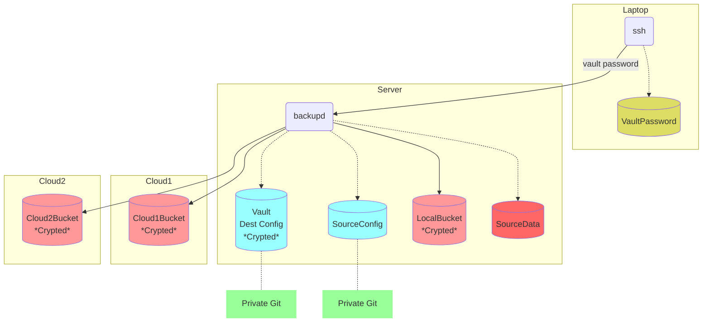

# Package
`github.com/tappoy/backupd`

See [Document.txt](Document.txt)

# Config of Source
- [backupd.config](./test-data/config/backupd.config)

# Config of Destination
- aws: [.aws.config](https://github.com/tappoy/storage/blob/main/.aws.config.sample)
- local: [.local.config](https://github.com/tappoy/storage/blob/main/.local.config.sample)
- openstack: [.openstack.config](https://github.com/tappoy/storage/blob/main/.openstack.config.sample)

# Operation Example
```sh
# set vault dir and password
user@local$ cat .vault-password | ssh user@remote 'backupd vault /opt/vault'
```

# Structure Example



# Dependencies
- [github.com/tappoy/env](https://github.com/tappoy/env)
- [github.com/tappoy/storage](https://github.com/tappoy/storage)
- [github.com/tappoy/vault-cli](https://github.com/tappoy/vault-cli)
- [github.com/tappoy/vault](https://github.com/tappoy/vault)

# Why it is this way.
See [Philosophy](https://github.com/tappoy/philosophy) for more details.

# License
[GPL-3.0](LICENSE)

# Author
[tappoy](https://github.com/tappoy)